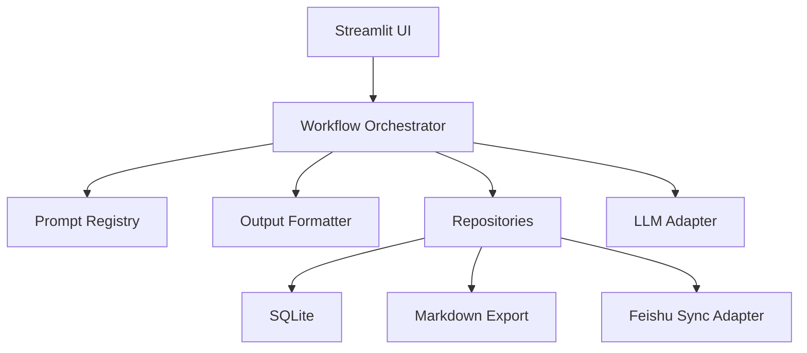
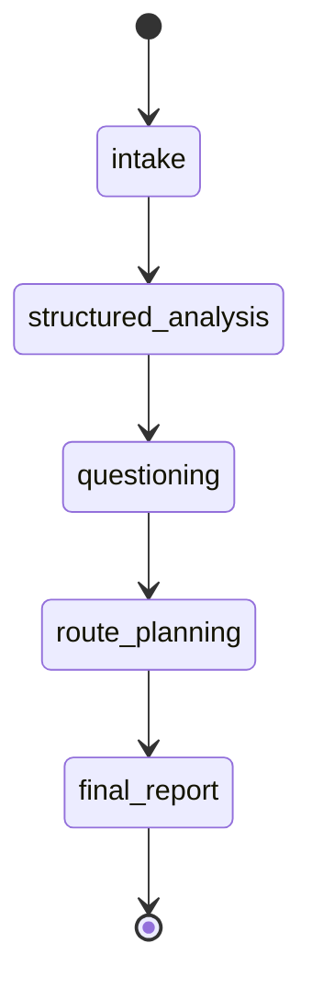

# 系统架构设计

## 1. 设计目标

- 支持四阶段职业咨询工作流
- 保持 `Streamlit` 首版实现简单
- 隔离 LLM 厂商依赖
- 为飞书多维表格接入预留边界

## 2. 总体架构



## 3. 分层说明

## 3.1 UI 层

目录：`src/ui/`

职责：

- 渲染页面
- 响应按钮点击
- 接收咨询师输入
- 展示格式化结果

不负责：

- 直接调用模型接口
- 处理数据库逻辑
- 组织业务工作流

## 3.2 Workflow 层

目录：`src/workflow/`

职责：

- 定义阶段顺序
- 装配 Prompt
- 组织 LLM 调用
- 保存阶段结果
- 控制状态推进

这是系统的核心业务编排层。

## 3.3 LLM Adapter 层

目录：`src/llm/`

职责：

- 对外提供统一 `generate()` 和 `generate_json()`
- 管理 `SiliconFlow` OpenAI 兼容调用细节
- 处理超时、重试、JSON 解析

设计原则：

- 不让 UI 和 Workflow 直接感知第三方 SDK 细节
- 后续更换到其他 OpenAI 兼容模型时尽量零改动业务代码

## 3.4 Prompt Registry 层

目录：`src/prompts/`

职责：

- 存放四阶段 Prompt 模板
- 统一读取模板并填充变量
- 控制 Prompt 版本

说明：

- 模板以 Markdown 文件存储，便于产品和 Prompt 工程共同维护

## 3.5 Domain 层

目录：`src/domain/`

职责：

- 定义案例、阶段结果、问题集、路线、报告等核心对象

说明：

- 领域模型只表达业务结构，不依赖 UI 或数据库实现

## 3.6 Storage 层

目录：`src/storage/`

职责：

- 初始化数据库
- 提供仓储方法
- 管理案例、版本、Prompt 调用日志和导出记录

首版采用 `SQLite`，原因：

- 零额外部署成本
- 对单用户本地应用足够
- 标准库可直接支持

## 3.7 Integrations 层

目录：`src/integrations/`

职责：

- 预留飞书多维表格同步
- 做第三方字段映射和 API 调用

首版不启用，只定义接口和数据映射约束。

## 4. 核心组件设计

## 4.1 Workflow Orchestrator

入口类：`ConsultationWorkflowService`

核心方法：

- `run_structured_analysis(case_id)`
- `run_question_generation(case_id)`
- `run_route_planning(case_id)`
- `run_final_report(case_id)`
- `save_manual_stage_output(case_id, stage_name, payload)`

工作流程：

1. 读取案例与相关历史阶段结果
2. 从 Prompt Registry 获取模板
3. 构造输入变量
4. 调用 LLM Adapter
5. 校验并格式化输出
6. 保存结果和日志
7. 更新案例阶段

## 4.2 LLM Adapter

接口：

```python
class BaseLLMClient:
    def generate(self, system_prompt: str, user_prompt: str, **kwargs) -> str:
        ...

    def generate_json(self, system_prompt: str, user_prompt: str, **kwargs) -> dict:
        ...
```

实现：

- `SiliconFlowClient`

关键能力：

- 统一 `base_url`
- 读取环境变量
- 注入模型名、温度、超时
- 解析 JSON 响应
- 报告错误上下文

## 4.3 Prompt Registry

接口：

- `get_prompt(name: str) -> str`
- `render_prompt(name: str, variables: dict) -> str`

设计要点：

- Prompt 只维护“指令”和“结构要求”
- 实际内容由 Workflow 按阶段填充

## 4.4 Formatter

职责：

- 把原始 JSON 输出整理为稳定展示结构
- 为终版报告生成 Markdown

避免：

- 在 UI 中写复杂格式化逻辑

## 4.5 Repository

核心仓储：

- `CaseRepository`
- `StageResultRepository`
- `PromptRunRepository`
- `ExportRepository`

说明：

- UI 只和 Workflow 交互
- Workflow 通过 Repository 访问数据

## 5. 阶段状态机



状态规则：

- 允许从任意阶段回退后重跑
- 每次重跑生成新的版本记录
- `current_stage` 始终代表当前最新完成阶段

## 6. 目录结构

```text
app.py
src/
  config/
    settings.py
  domain/
    models.py
  integrations/
    feishu/
      client.py
      mappers.py
  llm/
    base.py
    siliconflow_client.py
  prompts/
    final_report.md
    question_generation.md
    registry.py
    route_planning.md
    structured_analysis.md
  services/
    formatters.py
  storage/
    db.py
    repositories.py
  ui/
    components/
      report_view.py
    pages/
      case_intake.py
      final_report.py
      questioning.py
      route_planning.py
      structured_analysis.py
  workflow/
    orchestrator.py
    stages.py
docs/
data/
```

## 7. 关键设计决策

## 7.1 为什么用 Streamlit

- 快速做出咨询师可用原型
- 天然适合表单、文本编辑和结果展示
- 部署成本低

## 7.2 为什么按阶段拆 Prompt

- 降低单次输出失控概率
- 便于复盘具体哪个阶段质量差
- 便于未来替换某一阶段的 Prompt

## 7.3 为什么本地先用 SQLite

- 单咨询师场景足够
- 降低初期复杂度
- 方便未来迁移

## 7.4 为什么飞书先预留不集成

- 首版优先验证流程价值
- 飞书接入需要字段映射、鉴权和同步策略
- 先把领域模型做稳再接外部系统

## 8. 日志与观测

记录内容：

- 案例 ID
- 阶段名称
- Prompt 名称
- 使用模型
- 耗时
- 是否成功
- 原始响应摘要

不记录：

- 完整隐私原文
- API Key

## 9. 失败恢复机制

- 模型调用失败：提示重试，不丢失当前案例
- JSON 解析失败：展示原始文本并允许人工修正
- 数据库存储失败：展示错误消息并中断当前保存

## 10. 未来演进

### 10.1 飞书多维表格

通过 `Integrations` 层新增同步服务，不改动 Workflow 主体。

### 10.2 多用户

通过替换持久化和增加认证层实现。

### 10.3 更丰富的咨询模板

通过 Prompt Registry 增加风格模板和行业模板实现。
