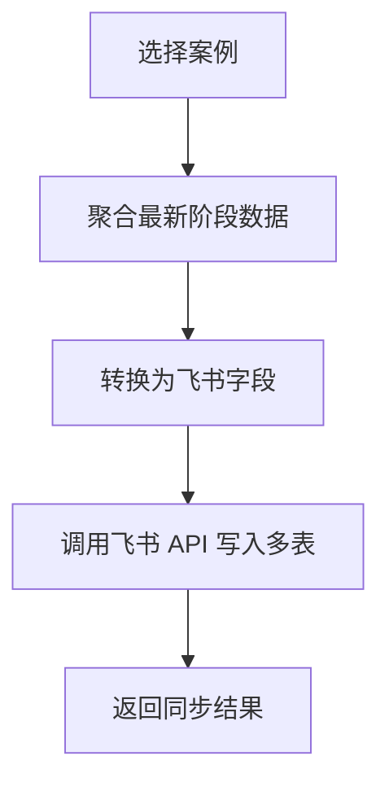

# 飞书多维表格接入前置条件

## 当前状态

当前项目已经完成：

- 飞书集成目录预留
- 基础映射器骨架
- 多表结构设计
- 咨询数据结构化建模

当前项目尚未完成：

- 飞书应用创建与鉴权
- 多维表格真实表结构落地
- 同步接口实现
- 增量更新与错误重试

## 接入前必须确认的事项

### 1. 飞书应用信息

需要你提供或自行配置：

- `app_id`
- `app_secret`
- 目标多维表格的 `app_token`
- 各数据表的 `table_id`

### 2. 同步策略

需要先决定：

- 是手动点击“同步当前案例”还是自动同步
- 是每次覆盖整条记录，还是只同步最新阶段
- 是单表承载所有字段，还是多表分层同步

建议首版采用：

- 手动同步
- 多表结构
- 只同步最新版本

### 3. 字段结构

建议在飞书中至少建立以下 5 张表：

- `Cases`
- `StructuredAnalysis`
- `FollowUpQuestions`
- `RoutePlans`
- `FinalReports`

### 4. 敏感信息策略

在同步前要决定：

- 原始文本是否全量上传飞书
- 是否只保留摘要和结构化字段
- 是否对姓名、学校、公司等敏感字段脱敏

建议首版：

- 不同步全量原始文本
- 只同步摘要和结构化结果
- 保留匿名化后的来访者代称

## 推荐技术方案

### 同步入口

在 `Streamlit` 终版报告页增加按钮：

- `同步到飞书`

### 同步流程



### 代码落点建议

- `src/integrations/feishu/client.py`
- `src/integrations/feishu/mappers.py`
- 新增 `src/integrations/feishu/sync_service.py`

## 实施顺序建议

1. 先在飞书创建多维表格和字段
2. 把 `app_token`、`table_id`、鉴权信息配置到环境变量或 `Streamlit secrets`
3. 实现“同步当前案例”的手动按钮
4. 先同步案例主表和终版报告表
5. 再扩展到拆解表、追问表和路线规划表

## Secrets 建议

未来接飞书时，建议在 `.streamlit/secrets.toml` 中新增：

```toml
FEISHU_APP_ID = "your_feishu_app_id"
FEISHU_APP_SECRET = "your_feishu_app_secret"
FEISHU_BITABLE_APP_TOKEN = "your_bitable_app_token"
FEISHU_CASES_TABLE_ID = "tbl_xxx"
FEISHU_STRUCTURED_TABLE_ID = "tbl_xxx"
FEISHU_QUESTIONS_TABLE_ID = "tbl_xxx"
FEISHU_ROUTES_TABLE_ID = "tbl_xxx"
FEISHU_REPORTS_TABLE_ID = "tbl_xxx"
```

## 下一步建议

在你完成 GitHub 和 Streamlit 部署后，下一轮我可以直接继续：

1. 实现飞书鉴权客户端
2. 实现多表字段映射
3. 在 UI 上增加“同步到飞书”按钮
4. 做单案例同步联调
