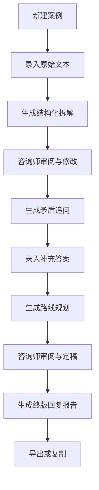

# 职业咨询 Agent PRD

## 1. 文档信息

- 产品名称：职业咨询 Agent
- 产品定位：面向职业咨询师的咨询助手
- 首版形态：`Streamlit` 单体 Web 应用
- 首版用户：单咨询师
- LLM 服务：`SiliconFlow`
- 默认模型：`deepseek-ai/DeepSeek-V3.2`
- 文档版本：`v1.0`

## 2. 产品背景

职业咨询过程通常存在三个明显痛点：

1. 来访者原始描述长、散、情绪化，咨询师需要花较多时间做结构化拆解。
2. 咨询价值不只在“建议”，更在于发现矛盾、追问模糊点、重建问题定义。
3. 咨询记录常散落在聊天记录、临时文档、表格中，后续难以复盘、复用和沉淀。

本产品希望把“结构化拆解 -> 矛盾追问 -> 路线规划 -> 回复报告”的流程产品化，让咨询师把精力放在判断和修正上，而不是重复整理文本。

## 3. 产品目标

### 3.1 业务目标

- 将单次咨询前处理时间缩短 50% 以上
- 形成可复用的标准咨询流程和输出格式
- 为后续接入飞书多维表格建立统一数据结构

### 3.2 用户目标

- 让咨询师在录入来访者文本后，快速拿到一版高质量结构化分析
- 帮助咨询师发现原始叙述中的矛盾、缺失信息和误判点
- 生成可编辑、可导出的正式回复报告

### 3.3 产品成功指标

- 结构化拆解平均生成时长 < 20 秒
- 单次咨询全流程完成时间 < 15 分钟
- 每个案例至少沉淀 1 份终版回复报告
- 咨询师对 AI 初稿可用性主观评分 >= 7/10

## 4. 用户与场景

### 4.1 核心用户画像

- 角色：职业咨询师
- 使用方式：将来访者原始文本粘贴进系统，逐阶段修正并输出结果
- 核心诉求：
  - 节省整理时间
  - 保持输出质量稳定
  - 能持续积累案例和方法论

### 4.2 典型使用场景

#### 场景 A：私域咨询回复前整理

咨询师收到一段长文本倾诉，希望快速生成一版结构化分析和回复草稿。

#### 场景 B：多轮追问后的整合

来访者补充了多轮信息，咨询师希望把补充信息并回原始案例，重新规划路线。

#### 场景 C：复盘历史个案

咨询师希望回看过往个案的结构化画像、追问点和最终建议，作为经验沉淀。

## 5. 产品原则

### 5.1 咨询师主导

系统是“助手”而不是“替代者”，每个阶段都允许人工修改和回退。

### 5.2 分阶段生成

不允许单个 Prompt 一次性输出全部结果，避免输出散乱和推理跳步。

### 5.3 结构先于文风

先保证结构化字段稳定，再追求报告语言风格优化。

### 5.4 数据可迁移

从首版开始按照“未来接飞书多维表格”的方式设计字段和数据关系。

## 6. MVP 范围

### 6.1 In Scope

- 新建案例
- 录入来访者原始文本
- 生成结构化拆解
- 生成矛盾追问问题集
- 记录补充回答
- 生成路线规划
- 生成终版回复报告
- 保存历史版本
- 导出 Markdown

### 6.2 Out of Scope

- 客户自助端
- 多咨询师账号体系
- 复杂权限与协作
- 自动消息推送
- 知识库检索与 RAG
- 飞书实时同步
- 模型微调和训练

## 7. 核心流程

## 8. 功能需求

## 8.1 案例管理

### 目标

让咨询师快速录入和管理个案。

### 功能点

- 新建案例
- 编辑基础信息
- 列表查看历史案例
- 查看当前阶段状态

### 输入字段

- 来访者代称
- 标签
- 原始文本

### 验收标准

- 能成功创建案例并保存到本地数据库
- 创建后默认状态为 `intake`
- 案例列表可按时间倒序显示

## 8.2 结构化拆解

### 目标

把原始文本拆解为标准咨询框架。

### 输出结构

- 核心画像
- 现状坐标
- 动力系统
- 约束系统
- 初步洞察
- 待追问点

### 交互要求

- 支持点击按钮生成
- 支持人工修改结构化结果
- 支持保存为当前阶段最新版本

### 验收标准

- 输出为结构化 JSON
- 前端可读性良好
- 保存后案例状态更新为 `structured_analysis`

## 8.3 矛盾追问工作台

### 目标

帮助咨询师生成高质量追问，并记录补充答案。

### 输出结构

- 问题文本
- 提问原因
- 优先级
- 对应回答

### 功能点

- 自动生成追问问题集
- 手动新增问题
- 删除不需要的问题
- 为问题填写回答

### 验收标准

- 至少支持 1 轮问题集生成和保存
- 问题可编辑
- 回答可保存并参与后续路线规划

## 8.4 路线规划

### 目标

基于拆解结果和补充信息输出可行动的建议。

### 输出结构

- 候选路线列表
- 每条路线的适配度
- 优势
- 风险
- 准备动作
- 推荐结论

### 功能点

- 自动生成多路线对比
- 标记主推路线
- 支持人工编辑路线描述

### 验收标准

- 至少输出 2 条候选路线
- 每条路线都包含优劣分析
- 状态更新为 `route_planning`

## 8.5 终版回复报告

### 目标

把前面阶段沉淀的内容转为面向来访者的正式回复稿。

### 输出结构

- 开场回应
- 核心判断
- 建议路径
- 近期行动建议
- 风险提醒

### 功能点

- 生成正式文本
- 支持直接复制
- 支持导出 Markdown

### 验收标准

- 文风完整，可直接用于人工修改后发送
- 保存后状态更新为 `final_report`

## 8.6 版本管理

### 目标

避免模型输出互相覆盖，保留每个阶段的历史版本。

### 功能点

- 每次生成结果保存一条版本
- 可查看各阶段最新版本
- 后续支持历史版本回看

### 验收标准

- 同一案例同一阶段可保存多条版本
- 每条版本都能溯源输入和输出

## 9. 页面设计

## 9.1 页面一：案例录入

### 主要区域

- 侧边栏案例列表
- 基本信息表单
- 原始文本输入区
- 创建按钮

### 关键操作

- 创建案例
- 选择已有案例

## 9.2 页面二：结构化拆解

### 主要区域

- 左侧原始文本
- 右侧结构化 JSON/格式化结果
- 生成按钮
- 保存按钮

## 9.3 页面三：矛盾追问工作台

### 主要区域

- 问题列表
- 原因说明
- 回答输入框
- 新增和删除按钮

## 9.4 页面四：路线规划

### 主要区域

- 路线卡片
- 推荐路线标记
- 行动清单编辑

## 9.5 页面五：终版报告

### 主要区域

- 报告正文
- 复制按钮
- 导出按钮

## 10. 非功能需求

### 10.1 可维护性

- 采用模块化目录结构
- Prompt 与代码解耦
- LLM 调用层独立封装

### 10.2 可扩展性

- 模型供应商可替换
- 存储可从 SQLite 升级为 PostgreSQL
- 可增加飞书同步模块

### 10.3 可观测性

- 记录 Prompt 调用日志
- 记录模型、耗时、成功状态

### 10.4 安全性

- API Key 仅从环境变量读取
- 不在日志中输出完整原始文本
- 后续导出支持匿名化

## 11. 风险与约束

### 11.1 Prompt 波动

风险：模型输出结构不稳定。

应对：使用明确 JSON schema 和本地校验。

### 11.2 咨询隐私

风险：个案包含敏感信息。

应对：日志只记录摘要，不记录全量明文。

### 11.3 路线误导

风险：模型给出表面合理但现实错误的职业路径。

应对：产品默认保留人工审阅节点，不允许自动直出最终建议。

## 12. 发布标准

达到以下条件即可视为 MVP 可用：

- 可新建和查看案例
- 四阶段工作流可跑通
- 结构化结果可保存
- 终版报告可导出
- 缺失 API Key 时有明确提示

## 13. 后续版本方向

- 客户自助填写入口
- 飞书多维表格同步
- 多咨询师协作
- 模板风格管理
- 案例检索与标签分析
